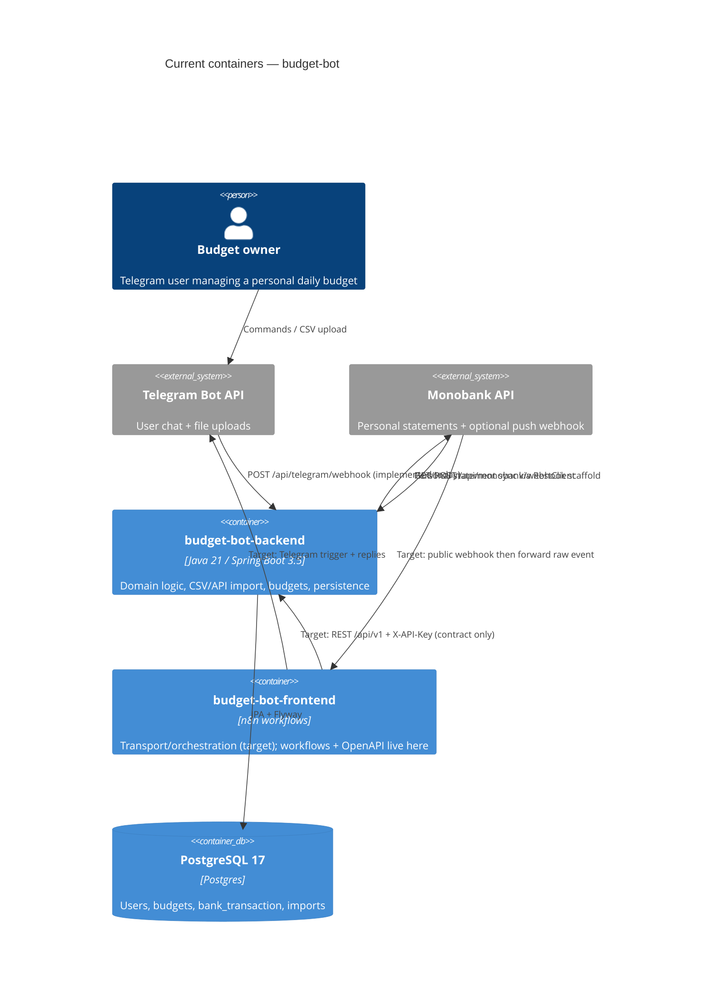

# Architecture map — budget-bot

> The **current** architecture (what exists today), produced by `survey` and read by
> specify / design / data-model / implement. Refresh with `survey` when the repo drifts past
> `reflects_commit`. This is generated; a hand-maintained `docs/architecture.md`, if present, is
> authoritative and reconciled below — not replaced.

## Stack

- Language / runtime: Java 21 (`budget-bot-backend/pom.xml:10`)
- Frameworks: Spring Boot 3.5.16 (Web, Data JPA, Validation, Actuator) (`budget-bot-backend/pom.xml:5`, `:12–15`); Apache Commons CSV 1.14.1 (`budget-bot-backend/pom.xml:19`); Lombok (`budget-bot-backend/pom.xml:20`)
- Datastore tooling: PostgreSQL 17 (`budget-bot-backend/docker-compose.yml:3`); Flyway (`budget-bot-backend/pom.xml:17–18`, `budget-bot-backend/src/main/resources/application.yml:12–13`)
- Integration frontend: n8n workflow JSON + OpenAPI contract (`budget-bot-frontend/README.md:1–23`) — not a web UI framework
- Build / test / lint: `mvn -f budget-bot-backend/pom.xml package` / `mvn -f budget-bot-backend/pom.xml test` (Spring Boot Maven plugin `budget-bot-backend/pom.xml:23`, JUnit test `MonobankCsvParserTest.java`); lint command unknown (no checkstyle/spotless/CI lint found)

## C4 — system as it is

## Module inventory

| Module | Path | Layers | Wired at | Responsibility |
|---|---|---|---|---|
| bootstrap | `budget-bot-backend/src/main/java/com/budgetbot` | app entry | `BudgetBotApplication.java:5–8` | Spring Boot + scheduling entrypoint |
| config | `…/com/budgetbot/config` | infra/config | `AppConfig.java:4–6` | `@ConfigurationProperties` for Telegram/Monobank/timezone |
| telegram | `…/com/budgetbot/telegram` | adapter/app | `TelegramWebhookController.java:7–14` | Direct Telegram webhook + update routing + outbound replies (live path) |
| user | `…/com/budgetbot/user` | domain/persistence | `AppUser.java:6–16` | Telegram-linked user entity/service |
| budget | `…/com/budgetbot/budget` | domain/app | `BudgetService.java:11–20` | Daily budget + status calculation (bank/Telegram-agnostic) |
| transaction | `…/com/budgetbot/transaction` | domain/app/persistence | `TransactionImportService` + `Fingerprint.java:6–8` | Normalize, classify, fingerprint-dedupe, persist |
| banking.csv | `…/com/budgetbot/banking/csv` | adapter/app | `CsvImportService.java:8–17`, `MonobankCsvParser.java:13–14` | Detect bank CSV, parse, import |
| banking.monobank | `…/com/budgetbot/banking/monobank` | adapter/app | `MonobankWebhookController.java:5–10` | Monobank RestClient sync + webhook scaffold |
| n8n frontend | `budget-bot-frontend/` | integration | `workflows/*.json`, `backend-contract/openapi.yaml` | Stateless transport workflows + target OpenAPI contract |

## Conventions (cited — the rules a new feature must match)

- **Module wiring / registration:** package-by-feature under `com.budgetbot`; Spring stereotypes + constructor injection (`@RequiredArgsConstructor`); CSV parsers register as `@Component` implementing `BankCsvParser` — `MonobankCsvParser.java:13–14`, `BudgetBotApplication.java:5–8`
- **Error handling:** no `@ControllerAdvice`; domain throws `IllegalArgumentException` / `IllegalStateException`; Telegram adapter catches and replies with `⚠️` — `BudgetService.java:19`, `TelegramUpdateService.java:37`
- **IDs:** DB/JPA `Long` identity (`GenerationType.IDENTITY` / `bigserial`); transaction dedupe via SHA-256 fingerprint string — `AppUser.java:10`, `Fingerprint.java:6–8`, `V1__init.sql:1–2`
- **Persistence / DB access:** Spring Data `JpaRepository` + Hibernate `ddl-auto: validate` — `BankTransactionRepository.java:7`, `application.yml:8–13`
- **Migrations:** Flyway `V{n}__{desc}.sql` under `src/main/resources/db/migration/` — `V1__init.sql:1`
- **Tests:** JUnit 5 + AssertJ unit tests without Spring context / Testcontainers yet — `MonobankCsvParserTest.java:6–16`
- **Inter-module communication:** in-process Spring bean calls; external HTTP via `RestClient` (Monobank) and Telegram HTTP client; target inter-system path is n8n → backend REST — `TelegramWebhookController.java:11–14`, `budget-bot-frontend/docs/ARCHITECTURE.md:3–17`
- **UI / styling (if a frontend exists):** no web UI / design system — Telegram message text is the UX surface; n8n formats transport replies only — `budget-bot-frontend/README.md:7–23`

## Datastores

| Store | Engine | Accessed via | Notes |
|---|---|---|---|
| `budgetbot` DB | PostgreSQL 17 | Spring Data JPA + Flyway | Tables: `app_user`, `budget`, `bank_transaction`, `transaction_import` (`V1__init.sql`); local via `docker-compose.yml` |
| Redis / broker | — | — | Not present in `pom.xml` / compose / `application.yml` |

## Frontend / UI foundation

<!-- N/A: no web UI component library — integration frontend only -->

- **Component library / design system:** none — Telegram chat is the user surface (`budget-bot-frontend/README.md:64–77`)
- **Design tokens:** none
- **Styling approach:** none (plain Telegram text / HTML escape in backend formatter path)
- **Shared primitives:** n8n workflow JSON templates — `budget-bot-frontend/workflows/telegram-budget-bot.json`, `monobank-webhook.json`, `backend-health.json`
- **State / data-fetching:** n8n must stay stateless w.r.t. financial domain; all state in PostgreSQL via backend (`budget-bot-frontend/docs/ARCHITECTURE.md:19–36`)
- **Closest UI precedent:** Telegram command + CSV upload UX documented in frontend README; live routing still in `TelegramUpdateService.handle` (`TelegramUpdateService.java:19+`)

## Where things live / closest precedents

- A new banking import adapter → `budget-bot-backend/.../banking/<bank>/` or `banking/csv`, modelled on `MonobankCsvParser` + `CsvImportService` (`MonobankCsvParser.java:13–14`, `CsvImportService.java:12–17`).
- A new domain calculation / budget rule → `budget` / `transaction` packages, modelled on `BudgetService` (`BudgetService.java:11–34`) — keep adapters out of this layer (`budget-bot-backend/ARCHITECTURE.md:27`).
- A new transport/orchestration path → `budget-bot-frontend/workflows/`, modelled on `telegram-budget-bot.json` / `monobank-webhook.json`, calling transport-neutral `/api/v1` once implemented (`BACKEND_CHANGES_REQUIRED.md:12–24`).
- A new screen / UI component → N/A (no web UI). Telegram reply formatting belongs in the integration layer, not domain services.

## Constraints & known tech-debt

- **Dual Telegram ownership:** backend still owns `TelegramWebhookController` / `TelegramClient`; frontend docs + OpenAPI describe n8n as the Telegram adapter and require `/api/v1` REST — contract not implemented in Java controllers yet (`BACKEND_CHANGES_REQUIRED.md:5–24`).
- **Identity drift:** OpenAPI user `id` is UUID-shaped in the contract; live schema uses `bigserial` / JPA `Long` (`V1__init.sql:1–2`, `AppUser.java:10`).
- **Monobank push webhook:** `POST /api/monobank/webhook` is a TODO noop scaffold (`MonobankWebhookController.java:8–10`).
- **PrivatBank CSV:** parser boundary exists but throws `UnsupportedOperationException` until a real Privat24 sample is supplied (README MVP notes).
- **Test depth:** only parser unit coverage; no Spring/Testcontainers integration suite yet.
- **No lint command** found in-repo (`lint_cmd` left empty).

## Reconciliation with the authored architecture doc

Authored inputs reconciled (not overwritten):

- `budget-bot-backend/ARCHITECTURE.md` — pipeline Telegram → services → NormalizedTransaction → import → BudgetService; claim that `BudgetService` is adapter-agnostic **aligns** with code.
- `budget-bot-frontend/docs/ARCHITECTURE.md` + README — n8n as stateless transport; Spring owns domain **is the target**. **Drift:** current running path still wires Telegram directly into the Spring app; `/api/v1` lives only in `budget-bot-frontend/backend-contract/openapi.yaml` and change list.

No root `docs/architecture.md` / ADRs present; this map is the current pipeline reference.
